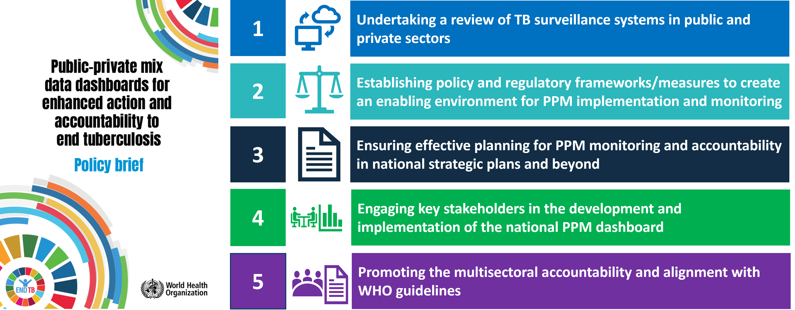

  
```{r setup, include=FALSE}

# Set chunk options.
# Results "asis" is needed to avoid xtable output being html encoded
# Suppress messages, warnings and also the ## at the beginning of printed text
# Set a default figure width too.

knitr::opts_chunk$set(echo = FALSE,
                      results = "asis",
                      message = FALSE,
                      warning = FALSE,
                      fig.width = 12)

# Load output packages ----
# - - - - - - - - - - - - - - - - - - - - - - - - - - - - - - - - - -
library(ggplot2)
library(ggrepel)
library(dplyr)
library(scales)
library(RColorBrewer)
library(whomap)
library(gtbreport)
library(here)

library(jsonlite)
library(dplyr)
library(here)
library(kableExtra)

# Load R functions ----
# - - - - - - - - - - - - - - - - - - - - - - - - - - - - - - - - - -
source(here("report/functions/html_links.R"))
source(here("report/functions/output_ggplot.R"))

# Get the data sets and computed values/statistics ----
# - - - - - - - - - - - - - - - - - - - - - - - - - - - - - - - - - - - 
source(here('report/ft_maf_prepare_data.r'))

# Show static chart in addition to Kendo chart?
show_static = F

# Save underlying data files as CSV and charts as PDF files?
pdf_csv_folder = here::here("report/local/figures/ft_maf")
save_csv = TRUE
save_pdf = TRUE

# Create the output folder (only if it doesn't yet exist)
dir.create(pdf_csv_folder, showWarnings = FALSE, recursive = TRUE)

```


```{r css_js}
# Add standard stylesheets and javascript to support kendo
cat(writeLines(readLines(here("report/resources/headers.htm"))))
```


```{css, echo=FALSE}
/* MAF table */
/* Recreating simple striped bootstrap table */
#maf_table {
  border-spacing: 0;
  border-collapse: collapse;
  margin-top: 1em;
  margin-bottom: 1em;
  /* Next two lines to allow horizontal scrolling on narrow screens */
  display: block;
  overflow-x: auto;
}

#maf_table th {
  background-color: #ADD8E6;
  border-bottom: 2px solid #DDDDDD;
  padding: 8px;
}

#maf_table td {
  border-top: 1px solid #DDDDDD;
  padding: 8px;
}

/* Bold for the final row with thick line above */
#maf_table tr:last-child td {
  border-top: 2px solid #DDDDDD;
  font-weight:bold;	
  background-color: #FBE4D5;
}

#maf_table tr:first-child td {
  border-top: 2px solid #DDDDDD;
  font-weight:bold;	
  background-color: #D2F7FF;
}


/* light gray when hovering over a row */
#maf_table tr:hover td {
  background-color: #DDDDDD;
}

/* Centre-align all column headings except for the first */
#maf_table th:not(:first-child) {
  text-align: center !important;
}

/* prevent numbers from wrapping in any of the columns */
#maf_table td {
  white-space: nowrap;
}

```

# The World Health Organization multisectoral accountability framework to end TB (MAF-TB): progress and way forward 
 
<span class="red">**_Draft! Prepared `r Sys.Date()`_**</span>  

Combating tuberculosis (TB) demands more than just efforts from the health sector – it requires decisive political commitment at the highest levels, robust collaboration across multiple sectors and a rigorous system of accountability (`r ref_lnk("1")`). Recognizing this, in the political declaration of the second United Nations (UN) high-level meeting on TB, held in September 2023 (`r ref_lnk("2")`), world leaders emphasized the need to advance the World Health Organization (WHO) multisectoral accountability framework to end TB (MAF-TB)  (`r ref_lnk("1")`). The commitment includes strengthening high-level multisectoral accountability and review mechanisms tailored to national contexts, clearly defining the roles and responsibilities of all relevant sectors and stakeholders, and ensuring meaningful engagement of people and communities affected by TB. The MAF-TB is also a key focus of the WHO Director-General’s flagship initiative to end TB over the period 2023&#8211;2027, underscoring its importance as a priority action (`r ref_lnk("3")`).

## Global level

WHO remains at the forefront of coordinating global monitoring, reporting and review efforts, in alignment with the global part of the MAF-TB. Through this collaborative, global, multisectoral and multistakeholder platform on ending TB, WHO continues to offer technical support and guidance to countries and partners.

To elevate the spotlight on the MAF-TB and guide countries in accelerating implementation of the MAF-TB, WHO hosted its first Global Forum on Advancing Multisectoral and Multistakeholder Engagement and Accountability to End TB in Dhaka, Bangladesh, in June 2024, with over 160 participants from around the world (`r ref_lnk("4")`). This significant event brought together countries, partners, civil society and key stakeholders from the health sector and beyond, to enhance capacity for multisectoral engagement and accountability as one of the main priorities in the fight against TB. The forum highlighted the importance of aligning and synchronizing efforts across sectors to combat TB, address the broader determinants of the epidemic, and monitor and report progress as part of a global review of the TB response. It was followed by a special Youth Townhall on ending TB under WHO’s 1+1 initiative; this event emphasized the role of young people in multisectoral efforts in the fight against TB. The role of the private sector and of unengaged public sector health care providers was also placed in the spotlight through two initiatives: the annual meeting of the Stop TB Working Group on Public-Private Mix (PPM Working Group) for TB prevention and care, and a special WHO consultation on strengthening monitoring through enhanced data dashboards for greater accountability. A workshop to build the capacity of consultants on the MAF-TB was organized in December 2023, to bolster WHO’s consultant roster for providing technical support to countries.

There is an urgent need for cross-sectoral collaboration to address the unprecedented levels of human migration and displacement, which have become critical public health priorities, especially when exacerbated by infectious diseases such as TB. In response, WHO has collaborated with the Qatar Foundation and the World Innovation Summit for Health in developing a special report on this important issue. The report outlines innovative strategies, new practices and effective approaches to improving TB prevention and care in various migration and displacement contexts. It features case studies showcasing effective actions in regions and countries including Qatar, the Greater Mekong subregion, the Middle East, Cox’s Bazar, the Amazonas, eastern Africa and Poland. These examples highlight the effectiveness of innovative approaches and multisectoral collaboration in tackling TB among refugees and migrants. WHO also continues to work closely with the United States Centers for Disease Control and Prevention (CDC), the UN Refugee Agency (UNHCR) and the International Organization for Migration (IOM) to keep a strong spotlight on addressing TB in refugees and migrants. A best-practice document is being developed following a call for case studies.

Social protection is another critical area of investment for strengthening the multisectoral engagement and accountability that is needed to address the social determinants of TB. Since 2022, nine countries (Cambodia, the Democratic Republic of the Congo, the Lao People’s Democratic Republic, Mongolia, Pakistan, the Philippines, South Africa, Uganda and Viet&nbsp;Nam) have conducted a social protection baseline assessment with WHO support, to investigate the extent to which social protection programmes operating at national or subnational level are inclusive for people affected by TB and are responsive to their needs (`r ref_lnk("5")`). The findings suggest that, overall, most social protection programmes operating in these countries are poorly accessible by people affected by TB or are inadequate to meet their needs. Factors at both the individual level and the system level explain the picture that emerged; for example, lack of awareness, illiteracy, hidden costs and stigma, together with policy incoherence, programme fragmentation, financial instability, and lengthy and complex enrolment processes. This evidence is crucial for identifying barriers and facilitators of multisectoral collaborations across the TB and social protection sector, understanding how to expand social protection coverage among people affected by TB, and ultimately enhancing the impact of key TB interventions. Further information about social protection is provided in  <span class="red">Section 5.2</span>.

WHO continues to advocate for scaling up the MAF-TB through different events and forums, to keep a high-level spotlight on the multisectoral response to end TB.


## National level

At the national level, WHO continues to actively support countries in accelerating MAF-TB implementation by providing technical assistance for progress assessments, programme reviews, the development of comprehensive national strategic plans and the integration of robust MAF-TB components (e.g. legislative, regulatory and other critical measures). WHO is also driving efforts to facilitate national multisectoral consultations and establish mechanisms for multisectoral coordination and review (`r ref_lnk("1,6")`). 

Annually since 2020, WHO has been collecting key MAF-TB-related indicators from all six WHO regions, as part of the organization’s annual round of global TB data collection. These indicators show that progress in MAF-TB adaptation and implementation has been made in over 100 countries. In `r report_year`, `r ftb(t1_data$ms_review [t1_data$entity == "Global total"])` countries reported that they had multisectoral accountability and review mechanisms in place, including `r ftb(t1_data$ms_review [t1_data$entity == "High TB burden countries"])` of the 30 high TB burden countries (`r lnk("Table 1")`). This was an increase from `r ftb(t1_txt_2020$ms_review)` countries in 2020. A total of `r ftb(t1_data$ms_review_civil_soc[t1_data$entity == "Global total"])` countries in `r report_year`, including `r ftb(t1_data$ms_review_civil_soc[t1_data$entity == "High TB burden countries"])` of the 30 high TB burden countries, reported that civil society and affected communities were represented in their multisectoral accountability and review mechanisms, an increase from `r ftb(t1_txt_2020$ms_review_civil_soc)` countries in 2020. Also in `r report_year`, `r ftb(t1_data$annual_report_published [t1_data$entity == "Global total"])` countries reported publishing an annual TB report on progress towards national TB-related targets and commitments, including `r ftb(t1_data$annual_report_published[t1_data$entity == "High TB burden countries"])` of the 30 high TB burden countries, and `r ftb(t1_txt_latest$all_three)` countries had all three MAF-TB core elements in place.


### `r anch("Table 1")`<span style="color:#F21905">Table 1</span> Status of core elements of multisectoral accountability for WHO regions, globally and the 30 high TB burden countries, `r report_year`

```{r echo=FALSE, message=FALSE, warning=FALSE, results = "asis", dev = 'png', table_1, fig.alt="MAF status",fig.height=18}

# Create a table object using kable
table_header <- linebreak(c('WHO regions, global total and high TB burden countries',
                  'Number of countries and areas',
                  'National multisectoral and multistakeholder accountability<br>and review mechanism, under high-level leadership',
                  'Engagement of civil society and affected communities in the multisectoral accountability and review mechanism',
                  'Annual national TB report publicly available',
                  'All three core elements'
))

knitr::kable(t1_data_table,
             format = "html",
             col.names = table_header,
             align = 'lccccc',
             # Add a table ID so that it can be styled using extra CSS in Sitefinity
             table.attr = "id='maf_table'",escape = FALSE) 

```

<hr />
<br />


In `r report_year`, data were also collected to better understand the extent to which different sectors were engaged in the TB response. The findings suggest that the most widely engaged sector was education, with `r ftb(f1_txt$pct[f1_txt$variable == "Education"&f1_txt$category == 230])`% of countries globally reporting that this sector was engaged in advocacy, information sharing, education and communication in the TB response (`r lnk("Fig. 1")`). 

The defence sector (in `r ftb(f1_txt$pct[f1_txt$variable == "Defence"&f1_txt$category == 231])`% of countries globally) and the justice sector (in `r ftb(f1_txt$pct[f1_txt$variable == "Justice"&f1_txt$category == 231])`% of countries globally) were mostly engaged in TB prevention and care, whereas the social development sector (in `r ftb(f1_txt$pct[f1_txt$variable == "Social development"&f1_txt$category == 232])`% of countries globally) is mostly engaged in patient support, including provision of economic, social or nutritional benefits. The data highlight the considerable scope to increase engagement across these key sectors and beyond (`r lnk("Fig. 1")`, `r lnk("Fig. 2")`).
  
### `r anch("Fig. 1")`<span style="color:#F21905">Fig. 1</span> Global percentage of countries with ministries (beyond health) engaged in the TB response in `r report_year` based on data reported by national TB programmes, for three topic areas

```{r fig_1, fig.alt="MAF global"}

f1_plot <- f1_data %>%
  
  mutate(category = factor(category, labels = c("Advocacy, information, enducation and communication", "TB prevention and care", "Patient support including economic, social or nutritional benefits"))) %>%
  
  ggplot(aes(category,
             pct,
             fill = category)) +
 
  geom_bar(stat = "identity") +
  facet_wrap( ~ variable, nrow = 2) +
  
  theme_gtb() +

  scale_fill_manual("", 
                    values = c("dodgerblue3","darkorange2","grey50")) +

  labs(x="", y="Percentage") +
  theme(
    axis.title.x = element_blank(),
    axis.text.x = element_blank())

output_ggplot(f1_plot, f1_data, show_static, pdf_csv_folder, save_csv, save_pdf)


```

<div class="row">
<div class="col-md-4">
<div id="fig_1_agr"></div>
</div>
<div class="col-md-4">
<div id="fig_1_def"></div>
</div>
<div class="col-md-4">
<div id="fig_1_edu"></div>
</div>
</div>

<div class="row">
<div class="col-md-4">
<div id="fig_1_fin"></div>
</div>
<div class="col-md-4">
<div id="fig_1_jus"></div>
</div>
<div class="col-md-4">
<div id="fig_1_lab"></div>
</div>
</div>

<div class="row">
<div class="col-md-4">
<div id="fig_1_soc"></div>
</div>
<div class="col-md-4">
<div id="fig_1_tra"></div>
</div>
</div>

<hr />
<br />
  

### `r anch("Fig. 2")`<span style="color:#F21905">Fig. 2</span> Percentage of countries with ministries (beyond health) engaged in the TB response in `r report_year` based on data reported by national TB programmes, disaggregated by WHO region and for the 30 high TB burden countries

```{r fig_2, fig.alt="MAF region"}

f2_plot <- f2_data %>%
  
  mutate(entity = factor(entity, levels = c("Global","African Region","Region of the Americas",
                                            "South-East Asia Region","European Region",
                                            "Eastern Mediterranean Region","Western Pacific Region",
                                            "High TB burden countries"))) %>%
  
  ggplot(aes(variable,
             pct,
             fill = variable)) +
 
  geom_bar(stat = "identity") +
  facet_wrap( ~ entity, nrow = 2) +
  
  theme_gtb() +

  scale_fill_manual("", 
                    values = c("dodgerblue3","darkorange2","grey50","goldenrod3","dodgerblue4","limegreen","navy","sienna4")) +

  labs(x="", y="Percentage") +
  theme(
    axis.title.x = element_blank(),
    axis.text.x = element_blank())

output_ggplot(f2_plot, f2_data, show_static, pdf_csv_folder, save_csv, save_pdf)


```


<div class="row">
<div class="col-md-4">
<div id="fig_2_Global"></div>
</div>
<div class="col-md-4">
<div id="fig_2_AFR"></div>
</div>
<div class="col-md-4">
<div id="fig_2_AMR"></div>
</div>
</div>

<div class="row">
<div class="col-md-4">
<div id="fig_2_SEA"></div>
</div>
<div class="col-md-4">
<div id="fig_2_EUR"></div>
</div>
<div class="col-md-4">
<div id="fig_2_EMR"></div>
</div>
</div>

<div class="row">
<div class="col-md-4">
<div id="fig_2_WPR"></div>
</div>
<div class="col-md-4">
<div id="fig_2_HBC"></div>
</div>
</div>

<hr />
<br />


As requested by world leaders in the political declaration of the 2023 UN high-level meeting on TB, WHO will continue to provide leadership across all three levels of the organization (i.e. WHO country offices, regional offices and headquarters), to support countries in implementing the MAF-TB.


<div class="textbox">
## `r anch("Box 1")` Box 1

## PPM monitoring and data dashboards in priority countries for stronger accountability

Private sector health care providers or unengaged public sector health care providers are often the first point of care for people with symptoms of TB; hence, these providers are important for multisectoral engagement efforts to end TB. Engaging these providers is critical for closing well-documented gaps in access to TB care and prevention services, reducing unnecessary deaths and suffering caused by inappropriate treatment, slowing the emergence of drug resistance caused by substandard care, reducing transmission (by shortening delays to treatment), reducing catastrophic costs and impoverishment, and accelerating uptake of new tools (`r ref_lnk("7,8")`). Such engagement is highlighted as a priority in the End TB Strategy, the political declaration of the UN high-level meeting on TB and other commitments made by leaders.

Recognizing the need for strengthened PPM monitoring, WHO has been working with national TB programmes (NTPs) to establish and expand the use of digital TB surveillance systems. It has also been working to expand the scope of indicators reported under the private sector and unengaged public sector, to increase the visibility of their contribution to TB care and prevention and to better monitor the quality of their outcomes. This work has been advanced through a special initiative with the Bill & Melinda Gates Foundation that promotes the development of enhanced PPM data dashboards in seven priority countries: Bangladesh, India, Indonesia, Kenya, Nigeria, Pakistan and the Philippines. Building on the lessons learned from the set-up of standardized TB PPM data dashboards in those seven countries, some of the most critical considerations to develop and operationalize PPM data dashboards have been outlined in a WHO policy brief and are presented in `r lnk("Fig. 3")`. These approaches cover regulatory framework needs, inclusivity of all stakeholders, technical aspects of developing dashboards and overarching alignment with WHO’s normative guidance.

The initiative came to a close in August 2024. For more information, please see [PPM data dashboards for enhanced action and accountability to end TB](https://www.who.int/teams/global-tuberculosis-programme/public-private-mix-data-dashboards).

### `r anch("Fig. 3")`<span style="color:#F21905">Fig. 3</span> Five key approaches to strengthen PPM monitoring through enhanced data dashboards
```{r fig_3,fig.alt="PPM approaches", out.width = '40%'}



```


<div class="footnote">PPM: public–private mix.</div>

</div>

                                                                                                                                                            
`r anch("refs")`

<hr style="border:1px solid gray20">

**References**

1.	Multisectoral accountability framework to accelerate progress to end tuberculosis by 2030. Geneva: World Health Organization; 2019 (https://apps.who.int/iris/handle/10665/331934).

2.	Resolution 78/5: Political declaration of the high-level meeting of the General Assembly on the fight against tuberculosis. New York: United Nations; 2023 (https://undocs.org/A/RES/78/5).

3.	WHO Director-General Flagship Initiative to #ENDTB 2023-2027: Universal access to TB prevention and care: Towards Universal Health Coverage (UHC). Geneva: World Health Organization; 2023 (https://www.who.int/publications/m/item/who-director-general-flagship-initiative-to-endtb).

4.	WHO First Global Forum on Advancing Multisectoral and Multistakeholder Engagement and Accountability to End TB. Geneva: World Health Organization; 2024 (https://www.who.int/news/item/09-07-2024-who-first-global-forum-on-advancing-multisectoral-and-multistakeholder-engagement-and-accountability-to-end-tb).

5.	World Health Organization & International Labour Organization. Guidance on social protection for people affected by tuberculosis. Geneva: World Health Organization; 2024 (https://iris.who.int/handle/10665/376542).

6.	WHO Multisectoral accountability framework for TB (MAF-TB): baseline assessment checklist for country use in pursuing a national MAF-TB. Geneva: World Health Organization; 2020 (https://www.who.int/publications/m/item/who-multisectoral-accountability-framework-for-tb-(maf-tb)-baseline-assessment-checklist-for-country-use-in-pursuing-a-national-maf-tb).

7. Arsenault C, Roder-DeWan S, Kruk ME. Measuring and improving the quality of tuberculosis care: a framework and implications from the Lancet Global Health Commission. J Clin Tuberc Other Mycobact Dis. 2019;16:100112. doi: https://doi.org/10.1016/j.jctube.2019.100112.

8. Public–private mix for TB prevention and care: a roadmap. Geneva: World Health Organization; 2020 (https://www.who.int/publications/i/item/WHO-CDS-TB-2018.32).


  

```{r js_functions}
# Insert javascript file containing common Kendo number formatting functions ----
cat(writeLines(readLines(here("report/resources/gtbr_js.htm"))))
```


<script type="text/javascript">
/* JSON data objects for the figures */

var fig_1_data = `r f1_data %>% select(-n) %>% pivot_wider(names_from = category, values_from = pct) %>% rename("adv"=2, "tb"=3, "supp"=4) %>% mutate(cat="category") %>% toJSON("rows")`; 

var fig_2_data = `r f2_data %>% select(-n,-n_country) %>% pivot_wider(names_from = variable, values_from = pct) %>% rename("agr"=2, "def"=3, "dev"=4, "edu"=5, "fin"=6, "jus"=7, "lab"=8, "tra"=9) %>% mutate(cat="category") %>% toJSON("rows")`; 

</script>

```{js, echo=FALSE}
/* Functions to create the figures */

function createFig_1(fig_ID, data, filter) {

  	// Filter the dataset on the country variable
		dataJSON = data.filter( element => element.variable == filter);
  
		$(fig_ID).kendoChart({
			dataSource: dataJSON,
			chartArea: {
				height: 300
			},	
			title: {
				text: filter,
				color: "black",
				font: "bold 14px  Arial,Helvetica,sans-serif",
        align: "center"
			},	  

			legend: {
				position: "bottom",
				orientation: "vertical",
			},
			seriesDefaults: {
				type: "column"
			},
			series: [
			{name: "Advocacy, information, education and communication",
				field: "adv",
				color: "dodgerblue",
        tooltip: {
				visible: true,
				template: "Advocacy, information, education and communication: #= value.toPrecision(2) #%"
			}
			},{
        name:  "TB prevention and care",
				field: "tb",
				color: "darkorange",
        tooltip: {
				visible: true,
				template: "TB prevention and care: #= value.toPrecision(2) #%"
			}
			},{
        name:  "Patient support including economic, social or nutritional benefits",
				field: "supp",
				color: "grey",
        tooltip: {
				visible: true,
				template: "Patient support: #= value.toPrecision(2) #%"
			}
			},],
			valueAxis: {
				title: {
					text: "Percentage"
				},
				line: {
					visible: false
				},
				max: 50,
				min: 0,
			},
			categoryAxis: {
				field: "cat",
				labels: {
					visible: false
				},
				majorGridLines: {
					visible: false
				},
				title: {
					text: ""
				}
			},
		});
}


function createFig_2(fig_ID, data, filter) {

  	// Filter the dataset on the country variable
		dataJSON = data.filter( element => element.entity == filter);
  
		$(fig_ID).kendoChart({
			dataSource: dataJSON,
			chartArea: {
				height: 300
			},	
			title: {
				text: filter,
				color: "black",
				font: "bold 14px  Arial,Helvetica,sans-serif",
        align: "center"
			},	  

			legend: {
				position: "bottom",
			},
			seriesDefaults: {
				type: "column"
			},
			series: [
			{name: "Agriculture",
				field: "agr",
				color: "dodgerblue",
        tooltip: {
				visible: true,
				template: "Agriculture: #= value.toPrecision(2) #%"
			}
			},{
        name:  "Defence",
				field: "def",
				color: "darkorange",
        tooltip: {
				visible: true,
				template: "Defence: #= value.toPrecision(2) #%"
			}
			},{
        name:  "Education",
				field: "edu",
				color: "grey",
        tooltip: {
				visible: true,
				template: "Education: #= value.toPrecision(2) #%"
			}
			},{
        name:  "Finance",
				field: "fin",
				color: "goldenrod",
        tooltip: {
				visible: true,
				template: "Finance: #= value.toPrecision(2) #%"
			}
			},{
        name:  "Justice",
				field: "jus",
				color: "#104E8B",
        tooltip: {
				visible: true,
				template: "Justice: #= value.toPrecision(2) #%"
			}
			},{
        name:  "Labour",
				field: "lab",
				color: "limegreen",
        tooltip: {
				visible: true,
				template: "Labour: #= value.toPrecision(2) #%"
			}
			},{
        name:  "Social development",
				field: "dev",
				color: "navy",
        tooltip: {
				visible: true,
				template: "Social development: #= value.toPrecision(2) #%"
			}
			},{
        name:  "Transport",
				field: "tra",
				color: "#8B4726",
        tooltip: {
				visible: true,
				template: "Transport: #= value.toPrecision(2) #%"
			}
			},],
			valueAxis: {
				title: {
					text: "Percentage"
				},
				line: {
					visible: false
				},
				max: 100,
				min: 0,
			},
			categoryAxis: {
				field: "cat",
				labels: {
					visible: false
				},
				majorGridLines: {
					visible: false
				},
				title: {
					text: ""
				}
			},
		});
}


```


```{js, echo=FALSE}
/* Create the figures after the document has been loaded */

$(document).ready(function () {
                  <!-- createFig_1("#fig_1",fig_1_data); -->
                  
                  createFig_1("#fig_1_agr",fig_1_data,"Agriculture");
                  createFig_1("#fig_1_def",fig_1_data,"Defence");
                  createFig_1("#fig_1_edu",fig_1_data,"Education");
                  createFig_1("#fig_1_fin",fig_1_data,"Finance");
                  createFig_1("#fig_1_jus",fig_1_data,"Justice");
                  createFig_1("#fig_1_lab",fig_1_data,"Labour");
                  createFig_1("#fig_1_soc",fig_1_data,"Social development");
                  createFig_1("#fig_1_tra",fig_1_data,"Transport");
                  
                  createFig_2("#fig_2_Global",fig_2_data,"Global");
                  createFig_2("#fig_2_AFR",fig_2_data,"African Region");
                  createFig_2("#fig_2_AMR",fig_2_data,"Region of the Americas");
                  createFig_2("#fig_2_SEA",fig_2_data,"South-East Asia Region");
                  createFig_2("#fig_2_EUR",fig_2_data,"European Region");
                  createFig_2("#fig_2_EMR",fig_2_data,"Eastern Mediterranean Region");
                  createFig_2("#fig_2_WPR",fig_2_data,"Western Pacific Region");
                  createFig_2("#fig_2_HBC",fig_2_data,"High TB burden countries");


}); 

```
