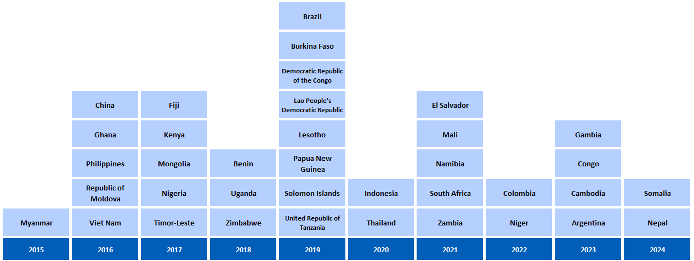

```{r setup, include=FALSE}

# Set chunk options.
# Results "asis" is needed to avoid xtable output being html encoded
# Suppress messages, warnings and also the ## at the beginning of printed text
# Set a default figure width too.

knitr::opts_chunk$set(echo = FALSE,
                      results = "asis",
                      message = FALSE,
                      warning = FALSE,
                      fig.width = 12)


# Load output packages ----
# - - - - - - - - - - - - - - - - - - - - - - - - - - - - - - - - - -
library(ggplot2)
library(dplyr)
library(scales)
library(RColorBrewer)
library(whomap)
library(gtbreport)
library(here)
library(Cairo)
library(cowplot)

library(tidyverse)

library(jsonlite)

# Load R functions ----
# - - - - - - - - - - - - - - - - - - - - - - - - - - - - - - - - - -
source(here("report/functions/html_links.R"))
source(here("report/functions/output_ggplot.R"))

# Get the data sets and computed values/statistics for section 6.1 ----
# - - - - - - - - - - - - - - - - - - - - - - - - - - - - - - - - - - - 
source(here('report/ch5-2_prepare_data.r'))


# Show static chart in addition to Kendo chart?
show_static = F

# Save underlying data files as CSV and charts as PDF files?
pdf_csv_folder = here::here("report/local/figures/ch5.2")
save_csv = TRUE
save_pdf = TRUE
save_cairo = TRUE

# Create the output folder (only if it doesn't yet exist)
dir.create(pdf_csv_folder, showWarnings = FALSE, recursive = TRUE)

```

```{r setup2, include=FALSE}
# Chapter 1
# Set options, load data, utility functions
knitr::opts_chunk$set(echo = FALSE,
                      results = "asis",
                      message = FALSE,
                      warning = FALSE)

```

```{r css_js}
# Add standard stylesheets and javascript to support kendo
cat(writeLines(readLines(here("report/resources/headers.htm"))))
```

# 5.2 Costs faced by TB-affected households, social protection and human rights 

<span class="red">**Draft! Prepared `r Sys.Date()` using country-reported data snapshot files from `r format(as.Date(snapshot_date), format="%d %B %Y")`!**</span>

The World Health Organization (WHO) End TB Strategy targets for reductions in tuberculosis (TB) disease burden (incidence and mortality) can only be achieved if everyone with TB is able to access diagnosis and treatment. This is not possible if costs (including direct medical expenditures, direct nonmedical expenditures and indirect costs such as income losses) are a major barrier to health care for people with TB. For this reason, both universal health coverage (UHC) and social protection are part of pillar 2 of the End TB Strategy, and one of the Strategy’s three high-level targets is that no TB-affected households face total costs that are catastrophic. 

The political declaration at the second United Nations (UN) high-level meeting on TB, held in September 2023, included a new target that all people with TB have access to a health and social benefits package by 2027 (`r ref_lnk("1")`).

UHC means that everyone can obtain the health services they need without suffering financial hardship (`r ref_lnk("2")`). Social protection is a set of policies and programmes designed to reduce and prevent poverty, vulnerability and social exclusion throughout the life cycle (`r ref_lnk("3")`). These can help to address the social determinants of TB, improve treatment outcomes and mitigate the financial hardships faced by people with TB and their households. 

In addition to the risk of financial hardship, people with TB can be exposed to conditions that increase their risk of poor health and social outcomes. Protection of human rights is essential to prevent and mitigate social exclusion and avoidable vulnerability, and to ensure optimal social and health outcomes. 

## Costs faced by people treated for TB and their households  

WHO has established standard methods for conducting a national survey to assess the total costs incurred by people treated for TB and their households (`r ref_lnk("4")`). Total costs are defined as the sum of direct medical expenditures, direct nonmedical expenditures and indirect costs (e.g. income losses), and catastrophic total costs are defined as costs exceeding 20% of annual household income or expenditure.

Since 2015, there has been substantial progress in the planning and implementation of such surveys (`r lnk("Fig. 5.2.1")`).

### `r anch("Fig. 5.2.1")`<span class="red">Fig. 5.2.1</span> National surveys of costs faced by people treated for TB and their households since 2015: progress and plans (as of August `r report_year`)

```{r fig_5.2.1,fig.alt="National surveys of costs faced by TB patients and their households since 2016: progress and plans"}

f5.2.1_plot <- f5.2.1_data %>%
  whomap(colours = palatte_fig5.2.1,
         legend.title = "Status",
         na.col = "white", water.col = "white",
#         na.label = "Not planned",
         legend.pos = c(0.14,0.40))

output_ggplot(f5.2.1_plot, f5.2.1_data, show_static = TRUE, pdf_csv_folder, save_csv, save_pdf)

```
<div class="footnote">Source: WHO Global Tuberculosis Programme</div>

<hr />
<br />

By August `r report_year`, `r ftb(f5.2.2_txt$all)` countries had completed a survey, including `r ftb(f5.2.2_txt$hbc30)` of the 30 high TB burden countries; six surveys were completed in the period 2023&#8211;2024 (`r lnk("Fig. 5.2.2")`). A repeat survey was ongoing in Viet Nam, and preparations for a repeat survey had been initiated in two countries: Brazil and Myanmar.

### `r anch("Fig. 5.2.2")`<span class="red">Fig. 5.2.2</span> Timeline of national surveys of costs faced by people treated for TB and their households that were completed 2015&#8211;2024 (as of August `r report_year`)

```{r fig_5.2.2,fig.alt="Timeline of national TB patient cost surveys implemented since 2015", out.width = '60%'}



```
<div class="footnote">Source: WHO Global Tuberculosis Programme</div>

<hr />
<br />

In surveys completed between 2015 and August `r report_year`, the average total cost per TB episode incurred by TB-affected households ranged from US\$&nbsp;`r ftb(f5.2.3_txt_min$value)` (95% confidence interval [CI]: US\$&nbsp;`r ftb(f5.2.3_txt_min$lci)`&#8211;`r ftb(f5.2.3_txt_min$uci)`) in `r gsub("(Solomon)|(Gambia)", "the \\1\\2", f5.2.3_txt_min$country)` to US\$&nbsp;`r ftb(f5.2.3_txt_max$value)` (95% CI: US\$&nbsp;`r ftb(f5.2.3_txt_max$lci)`&#8211;`r ftb(f5.2.3_txt_max$uci)`) in `r f5.2.3_txt_max$country` (`r lnk("Fig. 5.2.3")`). The mean cost for all countries is shown in constant US\$ prices for `r report_year` (i.e. costs have been adjusted for inflation since the year of the survey), to allow for fair comparisons.

### `r anch("Fig. 5.2.3")`<span style="color:#F21905">Fig. 5.2.3</span> Average cost per TB episode^a^ incurred by TB-affected household (mean, constant 2024 US$), national surveys completed 2015&#8211;`r report_year`^b^ 

```{r fig_5.2.3,fig.alt="Forest plot to show total costs in USD", fig.asp=0.9}

f5.2.3_plot <- 
  f5.2.3_const_data  %>% 
  filter(!is.na(value)) %>%
  mutate(country = factor(country, levels = f5.2.3_sel_order$country, ordered = TRUE)) %>% 
  ggplot(aes(x = country, y = value))+
  geom_point(size=4, col = "#F26829")+
  geom_pointrange(aes(ymin=lci,
                      ymax=uci),
                  size=1, col = "#F26829") +
  labs(x="",
       y="Mean cost (Constant 2024 US$)") +
  
  ylim(0,4500) +
  coord_flip() +
  theme_gtb() 

output_ggplot(f5.2.3_plot, f5.2.3_const_data, show_static, pdf_csv_folder, save_csv, save_pdf)

```
<div id="fig_5_2_3"></div>

<div class="footnote">^a^ Defined as the mean total cost (the sum of direct medical expenditures, direct nonmedical expenditures and indirect costs) incurred by people treated for TB and their households, for the entire TB episode from the onset of TB symptoms until the completion of TB treatment.
<br/>^b^ Estimates are shown for the `r nrow(f5.2.3_txt_num)` national surveys that had been completed by August `r report_year` and for which data about total costs have been published or shared with WHO. Data were not available for Benin, China and the Republic of Moldova. 95% confidence intervals were not reported in the national survey reports of El Salvador, Namibia and Zambia.
<br/>^c^ Results for Nepal are provisional.</div>


<hr />
<br />

The percentage of people treated for TB and their households that experienced catastrophic total costs (defined as >20% of annual household expenditure or income) ranged from `r ftb(f5.2.4a_txt_lo$catast_pct)`% (95% CI: `r ftb(f5.2.4a_txt_lo$catast_pct_lo)`&#8211;`r ftb(f5.2.4a_txt_lo$catast_pct_hi)`%) in `r f5.2.4a_txt_lo$country` to `r ftb(f5.2.4a_txt_hi$catast_pct)`% (95% CI: `r ftb(f5.2.4a_txt_hi$catast_pct_lo)`&#8211;`r ftb(f5.2.4a_txt_hi$catast_pct_hi)`%) in `r gsub("(Solomon)|(Gambia)", "the \\1\\2", f5.2.4a_txt_hi$country)` (`r lnk("Fig. 5.2.4")`). The pooled average for all countries, weighted for each country's number of notified cases, was `r ftb(f5.2.4a_txt$catast_pct)`% (95% CI: `r ftb(f5.2.4a_txt$catast_pct_lo)`&#8211;`r ftb(f5.2.4a_txt$catast_pct_hi)`%). Among `r nrow(f5.2.4c_txt_num)` countries that reported disaggregated data, the percentage facing catastrophic total costs was much higher for people with drug-resistant TB, with a pooled average of `r ftb(f5.2.4c_txt$catast_pct)`% (95% CI: `r ftb(f5.2.4c_txt$catast_pct_lo)`&#8211;`r ftb(f5.2.4c_txt$catast_pct_hi)`%).

### `r anch("Fig. 5.2.4")`<span style="color:#F21905">Fig. 5.2.4</span> Estimates of the percentage of people treated for TB and their households facing catastrophic total costs,^a^ national surveys completed 2015&#8211;`r report_year`^b^ 

```{r fig_5.2.4,fig.dim = c(12, 10),fig.alt="Forest plot to show selected baseline results from national surveys of costs faced by TB patients and their households"}

f5.2.4a_plot <- 
  f5.2.4a_data  %>% 
  mutate(country = factor(country, levels = f5.2.4_sel_order$country, ordered = TRUE)) %>% 
  ggplot(aes(y = country, x = catast_pct, group=grp))+
  geom_point(aes(col=grp,shape=grp,size=grp))+
  geom_errorbar(aes(xmin=catast_pct_lo, xmax=catast_pct_hi,col=grp), width=0.5,cex=1) +
  xlim(0,100) + xlab(bquote('Percentage')) + ylab(NULL) +
  annotate("text", x = 0, y = nrow(f5.2.4a_data)+1.5, label = "All forms of TB", cex=5,hjust = 0)+
  coord_cartesian(clip = 'off') +
  scale_color_manual(values=c("darkblue","dodgerblue3")) +
  scale_shape_manual(values=c(18,20)) +
  scale_size_manual(values=c(5,4)) +
  theme_gtb() + theme(legend.position = "none") +
  theme(axis.title.x = element_text(face = 'bold',size=12)) +
  theme(axis.text.x  = element_text(face = 'plain',size=12)) +
  theme(axis.text.y  = element_text(face = c('bold',rep('plain',nrow(f5.2.4a_data)-1)),size=12))


f5.2.4b_plot <- 
  f5.2.4b_data  %>% 
  mutate(country = factor(country, levels = f5.2.4_sel_order$country, ordered = TRUE)) %>% 
  ggplot(aes(y = country, x = catast_pct, group=grp))+
  geom_point(aes(col=grp,shape=grp,size=grp))+
  geom_errorbar(aes(xmin=catast_pct_lo, xmax=catast_pct_hi,col=grp), width=0.5,cex=1) +
  # geom_text(aes(label="NA",x=96,y=6),vjust=0.5,hjust=-0,col="grey45",size=4)+
  xlim(0,100) + xlab("Percentage") + ylab(NULL) +
  annotate("text", x = 0, y = nrow(f5.2.4b_data)+1.5, label = bquote('Drug-susceptible'~'TB'^'c'), cex=5,hjust = 0)+
  coord_cartesian(clip = 'off') +
  scale_color_manual(values=c("green4","seagreen3")) +
  scale_shape_manual(values=c(18,20)) +
  scale_size_manual(values=c(5,4)) +
  theme_gtb() +
  theme(legend.position = "none") +
  theme(axis.title.x = element_text(face = 'bold',size=12)) +
  theme(axis.text.x  = element_text(face = 'plain',size=12)) +
  theme(axis.text.y  = element_text(face = c('bold',rep('plain',nrow(f5.2.4b_data)-1)),size=12))

f5.2.4c_plot <- 
  f5.2.4c_data  %>% 
  mutate(country = factor(country, levels = f5.2.4_sel_order$country, ordered = TRUE)) %>% 
  ggplot(aes(y = country, x = catast_pct, group=grp))+
  geom_point(aes(col=grp,shape=grp,size=grp))+
  geom_errorbar(aes(xmin=catast_pct_lo, xmax=catast_pct_hi,col=grp), width=0.5,cex=1) +
  geom_text(aes(label="NA",x=96,y=2),vjust=0.5,hjust=-0,col="grey45",size=4)+
  geom_text(aes(label="NA",x=96,y=12),vjust=0.5,hjust=-0,col="grey45",size=4)+
  geom_text(aes(label="NA",x=96,y=34),vjust=0.5,hjust=-0,col="grey45",size=4)+
  geom_text(aes(label="NA",x=96,y=36),vjust=0.5,hjust=-0,col="grey45",size=4)+
  xlim(0,100) + xlab("Percentage") + ylab(NULL) +
  annotate("text", x = 0, y = nrow(f5.2.4c_data)+1.5, label = bquote('Drug-resistant'~'TB'^'c'), cex=5,hjust = 0)+
  coord_cartesian(clip = 'off') +
  scale_color_manual(values=c("firebrick4","firebrick3")) +
  scale_shape_manual(values=c(18,20)) +
  scale_size_manual(values=c(5,4)) +
  theme_gtb() +
  theme(legend.position = "none") +
  theme(axis.title.x = element_text(face = 'bold',size=12)) +
  theme(axis.text.x  = element_text(face = 'plain',size=12)) +
  theme(axis.text.y  = element_text(face = c('bold',rep('plain',nrow(f5.2.4c_data)-1)),size=12))

# aligned_plots <- align_plots(f5.2.4a_plot,f5.2.4b_plot,f5.2.4c_plot, align="hv", axis="tblr") 
f5.2.4_plot <- ggdraw() +
  draw_plot(f5.2.4a_plot, x=0,   y=0.5, width=1, height=0.5) +
  draw_plot(f5.2.4b_plot, x=0,   y=0, width=0.5, height=0.5) +
  draw_plot(f5.2.4c_plot, x=0.5, y=0, width=0.5, height=0.5) 

f5.2.4bc_plot <- plot_grid(f5.2.4b_plot, f5.2.4c_plot)
f5.2.4bc_data <- plyr::rbind.fill(f5.2.4b_data, f5.2.4c_data)

output_ggplot(f5.2.4a_plot, f5.2.4a_data, show_static, pdf_csv_folder, save_csv, save_pdf, save_cairo = T)
output_ggplot(f5.2.4bc_plot, f5.2.4bc_data, show_static, pdf_csv_folder, save_csv, save_pdf, save_cairo = T)

```

<div id="fig_5_2_4a"></div>

<div class="row">
<div class="col-md-6">
<div id="fig_5_2_4b"></div>
</div>
<div class="col-md-6">
<div id="fig_5_2_4c"></div>
</div>
</div>


<div class="footnote">
^a^ Defined as direct medical expenditures, direct nonmedical expenditures and indirect costs (e.g. income losses) that sum to >20% of annual household income. This indicator is not the same as the SDG indicator for catastrophic health expenditures; see <span style="color:#F21905">Box 3</span> of the main report for further explanation.
<br />^b^ The percentages are shown for `r nrow(f5.2.4a_txt_num)` national surveys that have been completed and for which data have been reported. Data were not available for China and the Republic of Moldova.
<br />^c^ Disaggregated estimates for drug-susceptible TB and drug-resistant TB were available for only `r nrow(f5.2.4c_txt_num)` countries. Disaggregated data were not available for El Salvador, Fiji, Timor-Leste and the Solomon Islands. The calculation of confidence intervals for Mali and Uganda did not account for sampling design.
<br/>^d^ Results for Nepal are provisional.
<br />Source: WHO Global Tuberculosis Programme</div>

<hr />
<br />

The distribution of costs faced by people treated for TB and their households varied among countries (`r lnk("Fig. 5.2.5")`). However, it was evident that &#8211; despite the widespread norm of "free TB care" policies &#8211; TB-affected households still faced direct medical costs. Such costs accounted for a sizeable proportion (20% or more) of total costs in `r int2word(f5.2.5_txt_med_list)` countries (`r gsub("(Congo)|(Gambia)", "the \\1\\2", knitr::combine_words(f5.2.5_txt_med$country, oxford_comma=FALSE))`). Minimizing direct medical costs borne by TB-affected households should be a high priority for national TB programmes (NTPs) and ministries of health.

The surveys also showed that actions are needed to eliminate direct nonmedical costs and to reduce indirect costs. The combined cost of transportation, food, accommodation, nutritional supplements and other nonmedical expenditures ("direct nonmedical costs") accounted for a substantial share (50% or more) of total costs in `r f5.2.5_txt_nmed_list` countries: `r gsub("(Philip)|(Democratic)|(United)|(Solomon)", "the \\1\\2\\3\\4", knitr::combine_words(f5.2.5_txt_nmed$country, oxford_comma=FALSE))`. 

Indirect costs associated with lost income, loss of employment or time lost while seeking or staying in care accounted for the largest single share of total costs in `r f5.2.5_txt_indirect_list` countries: `r gsub("(Philip)|(Democratic)|(Gambia)|(Congo)", "the \\1\\2\\3\\4", knitr::combine_words(f5.2.5_txt_indirect$country, oxford_comma=FALSE))`.

All cost categories are influenced by the model of TB care; for example, the extent to which there is reliance on hospitalization or outpatient care, the frequency with which attendance at health facilities is requested and the level to which services are decentralized to allow delivery of services as close as possible to where people live. They are also influenced by ease of access to the health facilities used to provide care, and the level of social protection.

### `r anch("Fig. 5.2.5")`<span style="color:#F21905">Fig. 5.2.5</span> Distribution of costs faced by people treated for TB and their households in national surveys completed 2015&#8211;`r report_year`^a^  

```{r fig_5.2.5,fig.dim = c(12, 9)}

f5.2.5_plot <- f5.2.5_data %>% 
  # pivot_longer(p_med:p_indirect,names_to="cat") %>% 
  mutate(country = factor(country, levels = f5.2.5_sel_order$country, ordered = TRUE)) %>% 
  mutate(cat=factor(cat,levels=c("p_indirect","p_nmed","p_med"))) %>%
  ggplot(aes(fill=cat, y=value, x=country)) + 
  geom_bar(stat="identity", position="fill") +
  scale_fill_manual(name = NULL,
                      labels = c("Indirect","Direct, nonmedical","Direct, medical"),
                      values = palatte_f5.2.5,
                      guide = guide_legend(reverse=TRUE))+
  theme_gtb() + theme(legend.position = "bottom") +
  theme(
    axis.line.y=element_blank(),
    axis.text.y=element_text(size=12,face="plain"))+
  xlab("")+
  scale_y_continuous(name ="Cost breakdown (%)",
                     labels = scales::percent_format(accuracy = 1))+
  coord_flip()

output_ggplot(f5.2.5_plot, f5.2.5_data, show_static, pdf_csv_folder, save_csv, save_pdf)


```
<div id="fig_5_2_5"></div>
<div class="footnote">^a^ Distributions are shown for `r nrow(f5.2.5_txt_num)` national surveys that have been completed and for which data were reported. Data were not available for Benin, China and the Republic of Moldova.
<br/>^b^ Results for Nepal are provisional.
<br />Source: WHO Global Tuberculosis Programme</div>


<hr />
<br />


In 2023, results from national surveys were used to produce model-based estimates of the percentage of people treated for TB and their households facing catastrophic total costs in all 135 low and middle-income countries (LMICs) (`r ref_lnk("5")`). The model-based estimate for all countries was `r ftb(f5.2.6_txt_global$est)`% (95% CI: `r ftb(f5.2.6_txt_global$est_lo)`&#8211;`r ftb(f5.2.6_txt_global$est_hi)`%). Among the six WHO regions, the highest percentage was in the African Region: `r ftb(f5.2.6_txt_afro$est)`% (95% CI: `r ftb(f5.2.6_txt_afro$est_lo)`&#8211;`r ftb(f5.2.6_txt_afro$est_hi)`%) (`r lnk("Fig. 5.2.6")`). 

### `r anch("Fig. 5.2.6")`<span class="red">Fig. 5.2.6</span> Model-based estimates of the percentage of people treated for TB and their households facing catastrophic total costs in 135 low- and middle-income countries (LMICs), overall and by WHO region
```{r fig_5.2.6, fig.alt="Forest plot showing Model-based estimates of catastrophic costs", fig.asp=0.4}

f5.2.6_plot <- f5.2.6_data %>% 

  ggplot(aes(x=entity,
             y=est)) +
  geom_point(size=4, col = "blueviolet") +


  labs(x="",
       y="Percentage (%)") +
  
  geom_pointrange(aes(ymin=est_lo,
                      ymax=est_hi),
                  size=1, col = "blueviolet") +
  
  expand_limits(y=0) + ylim(0,90) +
  coord_flip() +
  theme_gtb() 
  
output_ggplot(f5.2.6_plot, f5.2.6_data, show_static, pdf_csv_folder, save_csv, save_pdf)

```
<div id="fig_5_2_6"></div>
<div class="footnote">Source: Portnoy A, Yamanaka T, Nguhiu P, Nishikiori N, Garcia Baena I, Floyd K, et al. Costs incurred by people receiving tuberculosis treatment in low-income and middle-income countries: a meta-regression analysis. Lancet Glob Health. 2023;11:e1640-e7 (https://pubmed.ncbi.nlm.nih.gov/37734806/).</div>


<hr />
<br />

## Social protection

Social protection through a health and social benefits package is required to mitigate or eliminate costs faced by people with TB and their households. At the second UN high-level meeting on TB in September 2023, Member States adopted a new target that by 2027, 100% of people with TB should have access to a health and social benefits package (`r ref_lnk("1")`). In 2024, WHO requested all countries to report data about national policies related to financial and social protection for the first time, as a starting point for assessment of the status of progress with respect to this new target.

In `r report_year`, `r f5.2.7_txt_sp_num` countries reported having a national policy specifically related to social protection for people with TB and their households. The most common measure was free access to TB diagnosis (available in `r f5.2.7_txt_dx_num` countries) and treatment (available in `r f5.2.7_txt_tx_num` countries) (`r lnk("Fig. 5.2.7a")` and `r lnk("Fig. 5.2.7b")`). Other forms of social protection, including enablers to adhere to treatment, cash transfers, support to help with food security and support to compensate for income loss, were reported by `r f5.2.7c_txt_num`, `r f5.2.7d_txt_num`, `r f5.2.7e_txt_num` and `r f5.2.7f_txt_num` countries respectively (`r lnk("Fig. 5.2.7c")`&#8211;`r lnk("Fig. 5.2.7f")`).

### `r anch("Fig. 5.2.7")`<span class="red">Fig. 5.2.7</span> Status of social protection for people with TB, by country, `r report_year`

#### `r anch("Fig. 5.2.7a")`(a) Free access to TB diagnosis
```{r fig 5.2.7a, fig.width=12,  fig.alt="Map for social protection - a"}

# produce the map
f5.2.7a_plot <- whomap(f5.2.7a_data,
       map.title = "",
       colours = palatte_fig5.2.7a,
       legend.title = "", 
       na.col = "white",water.col = "white",
         legend.pos = c(0.14,0.40))

output_ggplot(f5.2.7a_plot, f5.2.7a_data, show_static = T, pdf_csv_folder, save_csv, save_pdf)

```

#### `r anch("Fig. 5.2.7b")`(b) Free access to TB treatment
```{r fig 5.2.7b, fig.width=12,  fig.alt="Map for social protection  - b"}

# produce the map
f5.2.7b_plot <- whomap(f5.2.7b_data,
       map.title = "",
       colours = palatte_fig5.2.7b,
       legend.title = "", 
       na.col = "white",water.col = "white",
         legend.pos = c(0.14,0.40))

output_ggplot(f5.2.7b_plot, f5.2.7b_data, show_static = T, pdf_csv_folder, save_csv, save_pdf)

```

#### `r anch("Fig. 5.2.7c")`(c) Enablers to adhere to TB treatment
```{r fig 5.2.7c, fig.width=12,  fig.alt="Map for social protection  - c"}

# produce the map
f5.2.7c_plot <- whomap(f5.2.7c_data,
       map.title = "",
       colours = palatte_fig5.2.7c,
       legend.title = "", 
       na.col = "white",water.col = "white",
         legend.pos = c(0.14,0.40))

output_ggplot(f5.2.7c_plot, f5.2.7c_data, show_static = T, pdf_csv_folder, save_csv, save_pdf)

```

#### `r anch("Fig. 5.2.7d")`(d) Conditional and/or unconditional cash-transfers^a^
```{r fig 5.2.7d, fig.width=12,  fig.alt="Map for social protection  - d"}

# produce the map
f5.2.7d_plot <- whomap(f5.2.7d_data,
       map.title = "",
       colours = palatte_fig5.2.7d,
       legend.title = "", 
       na.col = "white",water.col = "white",
         legend.pos = c(0.14,0.40))

output_ggplot(f5.2.7d_plot, f5.2.7d_data, show_static = T, pdf_csv_folder, save_csv, save_pdf)

```
<div class="footnote">^a^ Cash transfers are non-contributory schemes or programmes providing cash benefits to individuals or households, usually financed out of taxation, other government revenue, or external grants or loans. Cash transfers can be provided unconditionally or conditionally (that is, subject to the condition that recipients/beneficiaries fulfil specific behavioural requirements). This may mean, for example, that beneficiaries must ensure their children attend school regularly, or that they utilize basic preventative nutrition and healthcare services.</div>


#### `r anch("Fig. 5.2.7e")`(e) Measures to ensure food security
```{r fig 5.2.7e, fig.width=12,  fig.alt="Map for social protection  - e"}

# produce the map
f5.2.7e_plot <- whomap(f5.2.7e_data,
       map.title = "",
       colours = palatte_fig5.2.7e,
       legend.title = "", 
       na.col = "white",water.col = "white",
         legend.pos = c(0.14,0.40))

output_ggplot(f5.2.7e_plot, f5.2.7e_data, show_static = T, pdf_csv_folder, save_csv, save_pdf)

```

#### `r anch("Fig. 5.2.7f")`(f) Measures to compensate for income loss
```{r fig 5.2.7f, fig.width=12,  fig.alt="Map for social protection - f"}

# produce the map
f5.2.7f_plot <- whomap(f5.2.7f_data,
       map.title = "",
       colours = palatte_fig5.2.7f,
       legend.title = "", 
       na.col = "white",water.col = "white",
         legend.pos = c(0.14,0.40))

output_ggplot(f5.2.7f_plot, f5.2.7f_data, show_static = T, pdf_csv_folder, save_csv, save_pdf)

```

<div class="footnote">Source: WHO Global Tuberculosis Programme</div>

<hr />
<br />

## Human rights: protection from stigma, discrimination and social exclusion

Stigma and associated discrimination and social exclusion are major contributors to the vulnerability of people affected by TB. They can significantly increase costs incurred by people with TB: for example, if people with TB are evicted from their homes, if they lose their jobs, or if they are excluded from social protection programmes based on their clinical status or because of welfare stigma (defined as “the negative socio-physiological consequences“ or “psychic costs“ of receiving welfare benefits and being thus perceived a burden for the society) (`r ref_lnk("3,6")`). Thus, in addition to access to social protection programmes to protect people affected by TB from financial hardship, people with TB need to be protected from stigma, discrimination and social exclusion.

In 2024, `r ftb(f5.2.8_txt_num)` countries reported having national laws and regulations against stigma, discrimination and social exclusion due to TB. Such protective policies are not yet in place in many countries in the African Region, the Region of the Americas and the Western Pacific Region (`r lnk("Fig. 5.2.8")`).

### `r anch("Fig. 5.2.8")`<span class="red">Fig. 5.2.8</span>  Status of national laws and regulations against stigma and discrimination due to TB, by country, `r report_year`

#### `r anch("Fig. 5.2.8a")`(a) Protection from losing job
```{r fig 5.2.8a, fig.width=12,  fig.alt="Map for social protection - a"}

# produce the map
f5.2.8a_plot <- whomap(f5.2.8a_data,
       map.title = "",
       colours = palatte_fig5.2.8a,
       legend.title = "", 
       na.col = "white",water.col = "white",
         legend.pos = c(0.14,0.40))

output_ggplot(f5.2.8a_plot, f5.2.8a_data, show_static = T, pdf_csv_folder, save_csv, save_pdf)

```

#### `r anch("Fig. 5.2.8b")`(b) Protection from housing eviction
```{r fig 5.2.8b, fig.width=12,  fig.alt="Map for social protection  - b"}

# produce the map
f5.2.8b_plot <- whomap(f5.2.8b_data,
       map.title = "",
       colours = palatte_fig5.2.8b,
       legend.title = "", 
       na.col = "white",water.col = "white",
         legend.pos = c(0.14,0.40))

output_ggplot(f5.2.8b_plot, f5.2.8b_data, show_static = T, pdf_csv_folder, save_csv, save_pdf)

```

#### `r anch("Fig. 5.2.8c")`(c) Protection for parental rights over children
```{r fig 5.2.8c, fig.width=12,  fig.alt="Map for social protection  - c"}

# produce the map
f5.2.8c_plot <- whomap(f5.2.8c_data,
       map.title = "",
       colours = palatte_fig5.2.8c,
       legend.title = "", 
       na.col = "white",water.col = "white",
         legend.pos = c(0.14,0.40))

output_ggplot(f5.2.8c_plot, f5.2.8c_data, show_static = T, pdf_csv_folder, save_csv, save_pdf)

```

#### `r anch("Fig. 5.2.8d")`(d) No restriction on access to congregate settings
```{r fig 5.2.8d, fig.width=12,  fig.alt="Map for social protection  - d"}

# produce the map
f5.2.8d_plot <- whomap(f5.2.8d_data,
       map.title = "",
       colours = palatte_fig5.2.8d,
       legend.title = "", 
       na.col = "white",water.col = "white",
         legend.pos = c(0.14,0.40))

output_ggplot(f5.2.8d_plot, f5.2.8d_data, show_static = T, pdf_csv_folder, save_csv, save_pdf)

```

#### `r anch("Fig. 5.2.8e")`(e) No compulsory isolation
```{r fig 5.2.8e, fig.width=12,  fig.alt="Map for social protection  - e"}

# produce the map
f5.2.8e_plot <- whomap(f5.2.8e_data,
       map.title = "",
       colours = palatte_fig5.2.8e,
       legend.title = "", 
       na.col = "white",water.col = "white",
         legend.pos = c(0.14,0.40))

output_ggplot(f5.2.8e_plot, f5.2.8e_data, show_static = T, pdf_csv_folder, save_csv, save_pdf)

```
<div class="footnote">Source: WHO Global Tuberculosis Programme</div>

<hr />
<br />

## For further information

Comprehensive documentation about the 20 national surveys of costs faced by people treated for TB and their households that were completed between 2015 and 2021, which used WHO-recommended methods and for which results have been shared with WHO, is available in a book published by WHO in 2023 (`r ref_lnk("7")`). This includes cross-cutting chapters on methods, results, policy implications and future direction, and profiles for each national survey in a standardized format. The coverage of social protection measures for people treated for TB and their households in these 20 countries is also summarized in Part II of the publication. 

Further details about model-based estimates of the percentage of people treated for TB and their households facing catastrophic total costs in LMICs, including country specific details and results disaggregated by drug resistance status and household income quintile, are available in a journal article (`r ref_lnk("5")`). The country-specific estimates for LMICs that have not yet implemented a national survey are also provided in the Global tuberculosis report app.

Further information about social protection is provided in recent guidance published in 2024 by WHO and the International Labour Organization (ILO) (`r ref_lnk("3")`). The guidance aims to support the translation of existing best practices and current WHO and ILO policies into programmatic actions by NTPs, ministries of health and other relevant stakeholders. It sets out the essential concepts and operational steps needed to plan for and implement effective, sustainable and equitable social protection strategies to meet the socioeconomic needs of people affected by TB. 

Further details about policies to protect people from stigma and discrimination can be found in the [WHO global TB database](https://www.who.int/teams/global-tuberculosis-programme/data).

`r anch("refs")`

<hr style="border:1px solid gray20">

**References**

1.	Resolution 78/5: Political declaration of the high-level meeting of the General Assembly on the fight against tuberculosis. New York: United Nations; 2023 (https://undocs.org/A/RES/78/5). 

2.	World Health Organization, International Bank for Reconstruction and Development & World Bank. (‎2023)‎. Tracking universal health coverage: 2023 global monitoring report. Geneva: World Health Organization; 2023 (https://iris.who.int/handle/10665/374059).

3.	World Health Organization & International Labour Organization. (2024). Guidance on social protection for people affected by tuberculosis. Geneva: World Health Organization; 2024 (https://iris.who.int/handle/10665/376542).

4.	Tuberculosis patient cost surveys: a handbook. Geneva: World Health Organization; 2017 (https://iris.who.int/handle/10665/259701).

5.	Portnoy A, Yamanaka T, Nguhiu P, Nishikiori N, Garcia Baena I, Floyd K, et al. Costs incurred by people receiving tuberculosis treatment in low-income and middle-income countries: a meta-regression analysis. Lancet Glob Health. 2023;11:e1640-e7 (https://pubmed.ncbi.nlm.nih.gov/37734806/).

6.	Besley T, Coate S. Understanding welfare stigma: taxpayer resentment and statistical discrimination. Journal of Public Economics. 1992;48(2):165-183 (https://doi.org/10.1016/0047-2727(92)90025-B).

7.	National surveys of costs faced by TB patients and their households, 2015–2021. Geneva: World Health Organization; 2022 (https://iris.who.int/handle/10665/366277).


```{r js_functions}
# Insert javascript file containing common Kendo number formatting functions ----
cat(writeLines(readLines(here("report/resources/gtbr_js.htm"))))
```


<script type="text/javascript">
/* JSON data objects for the figures */

var fig_5_2_3_data = `r f5.2.3_const_data %>% filter(!is.na(value)) %>% select(!iso3) %>% arrange(desc(value)) %>% toJSON("rows")` ;

var fig_5_2_4a_data = `r f5.2.4a_data %>% filter(iso3!="AVE") %>% arrange(desc(catast_pct)) %>% add_row() %>% rbind.data.frame(filter(f5.2.4a_data, iso3=="AVE"))  %>% toJSON("rows")`   ;

var fig_5_2_4b_data = `r f5.2.4b_data %>% arrange(desc(factor(country, levels = f5.2.4_sel_order$country, ordered = TRUE)))  %>% filter(iso3!="AVE") %>% add_row() %>% rbind.data.frame(filter(f5.2.4b_data, iso3=="AVE"))  %>% toJSON("rows")`   ;

var fig_5_2_4c_data = `r f5.2.4c_data %>% arrange(desc(factor(country, levels = f5.2.4_sel_order$country, ordered = TRUE)))  %>% filter(iso3!="AVE") %>% add_row() %>% rbind.data.frame(filter(f5.2.4c_data, iso3=="AVE"))  %>% toJSON("rows")`   ;

var fig_5_2_5_data = `r f5.2.5_data %>% pivot_wider(names_from = cat, values_from = value) %>% arrange(desc(p_med)) %>% toJSON("rows")`   ;

var fig_5_2_6_data = `r f5.2.6_data %>% select(!g_whoregion)  %>% toJSON("rows")` ;


</script>

```{js, echo=FALSE}

/* Functions to create the figures */
function createFig_5_2_4(fig_ID, data, color, title) {
   
		$(fig_ID).kendoChart({
			dataSource: data,
			chartArea: {
				height: 900
			},	
			title: {
				text: title,
				color: "black",
				font: "bold 16px  Arial,Helvetica,sans-serif",
        align: "left"
			},	
			legend: {
				position: "bottom"
			},
			series: [{
        type: "bar",
				field: 0,
				opacity: 0
			}, {
        type: "line",
				field: "catast_pct",
        errorLowField: "catast_pct_lo",
        errorHighField: "catast_pct_hi",
        errorBars: {color: color, line: { width: 3 }},
        opacity: 0,
				color: color,
        markers: {
          visible: true,
          background: color,
          size: 6
        },
        
			tooltip: {
				visible: true,
        background: color,
				template: "#= category #: #= tb_format_pct(value)#%"
			}
			},{
				type: "rangeArea",
				fromField: "catast_pct_lo",
				toField: "catast_pct_hi",
				opacity: 0,
        color: color,
				tooltip: {
					visible: true,
          background: color,
				format: "{0}",
				template: "95% confidence interval (#= category #): #= tb_format_pct(value.from) #\u2013#= tb_format_pct(value.to) #%"
				}
			}
              ],
			valueAxis: {
				labels: {
					format: "{0}"
				},
				title: {
					text: "Percentage (%)"
				},
				line: {
					visible: false
				},
        min: 0,
        max: 102,
        majorUnit: 25,
			},
			categoryAxis: {
				field: "country",
				labels: {
					rotation: "auto"
				},
				majorGridLines: {
					visible: true
				}
			}

		});
}


function createFig_5_2_5(fig_ID, data, y_axis_title_text) {
		$(fig_ID).kendoChart({
			dataSource: data,
			chartArea: {
				height: 900
			},	
			legend: {
				position: "bottom"
			},
			seriesDefaults: {
				type: "bar",
        stack: true,
        gap: 0.2
			},
			series: [{
        name: "Direct medical",
				field: "p_med",
				color: "darkblue",
        tooltip: {
				visible: true,
				template: "Direct medical (#= category #): #= value.toPrecision(2) #%"
			}
			},{
        name: "Direct nonmedical",
				field: "p_nmed",
				color: "dodgerblue",
        tooltip: {
				visible: true,
				template: "Direct nonmedical (#= category #): #= value.toPrecision(2) #%"
			}
			},{
        name: "Indirect",
				field: "p_indirect",
				color: "goldenrod",
        tooltip: {
				visible: true,
				template: "Indirect (#= category #): #= value.toPrecision(2) #%"
			}
			},
              ],
			valueAxis: {

				title: {
					text: "Cost breakdown (%)"
				},
				line: {
					visible: false
				},
        min: 0,
        max: 100
			},
			categoryAxis: {
				field: "country",
				title: {
					text: y_axis_title_text
				},
				labels: {
					rotation: 0
				},
				majorGridLines: {
					visible: false
				}
        }
		});
}


function createFig_5_2_3(fig_ID, data, color, title) {
   
		$(fig_ID).kendoChart({
			dataSource: data,
			chartArea: {
				height: 900
			},	
			title: {
				text: title,
				color: "black",
				font: "bold 16px  Arial,Helvetica,sans-serif",
        align: "left"
			},	
			legend: {
				position: "bottom"
			},
			series: [{
        type: "bar",
				field: 0,
				opacity: 0
			}, {
        type: "line",
				field: "value",
        errorLowField: "lci",
        errorHighField: "uci",
        errorBars: {color: color, line: { width: 3 }},
        opacity: 0,
				color: color,
        markers: {
          visible: true,
          background: color,
          size: 6
        },
        
			tooltip: {
				visible: true,
        background: color,
				template: "#= category #: #= num_spacer(value) #"
			}
			},{
				type: "rangeArea",
				fromField: "lci",
				toField: "uci",
				opacity: 0,
        color: color,
				tooltip: {
					visible: true,
          background: color,
				format: "{0}",
				template: "95% confidence interval (#= category #): #= num_spacer(value.from) #\u2013#= num_spacer(value.to) #"
				}
			}
              ],
			valueAxis: {
				labels: {
					format: "{0}"
				},
				title: {
					text: "Mean total costs (constant 2024 US$)"
				},
				line: {
					visible: false
				},
        min: 0,
        max: 4500,
        majorUnit: 1000,
			},
			categoryAxis: {
				field: "country",
				labels: {
					rotation: "auto"
				},
				majorGridLines: {
					visible: true
				}
			}

		});
}


function createFig_5_2_6(fig_ID, data, color) {
   
		$(fig_ID).kendoChart({
			dataSource: data,
			chartArea: {
				height: 450
			},	
			legend: {
				position: "bottom"
			},
			series: [{
        type: "bar",
				field: 0,
				opacity: 0
			}, {
        type: "line",
				field: "est",
        errorLowField: "est_lo",
        errorHighField: "est_hi",
        errorBars: {color: color, line: { width: 3 }},
        opacity: 0,
				color: color,
        markers: {
          visible: true,
          background: color,
          size: 6
        },
			tooltip: {
				visible: true,
        background: color,
				template: "#= category #: #= value.toPrecision(2) #%"
			}
			},{
				type: "rangeArea",
				fromField: "est_lo",
				toField: "est_hi",
				opacity: 0,
        color: color,
				tooltip: {
					visible: true,
          background: color,
				format: "{0}",
				template: "#= category # (95% confidence interval): #= value.from.toPrecision(2) #\u2013#= value.to.toPrecision(2) #%"
				}
			},
              ],
			valueAxis: {
				labels: {
					format: "{0}"
				},
				title: {
					text: "Percentage (%)"
				},
				line: {
					visible: false
				},
        min: 0,
        max: 100
			},
			categoryAxis: {
				field: "entity",
				labels: {
					rotation: "auto"
				},
				majorGridLines: {
					visible: true
				}
			}

		});
}

function createFig_5_2_8(fig_ID, data, filter) {

  	// Filter the dataset on the country variable
		dataJSON = data.filter( element => element.entity == filter);
  
		$(fig_ID).kendoChart({
			dataSource: dataJSON,
			chartArea: {
				height: 300
			},	
			title: {
				text: filter,
				color: "black",
				font: "bold 14px  Arial,Helvetica,sans-serif",
        align: "center"
			},	  

			legend: {
				position: "bottom",
			},
			seriesDefaults: {
				type: "column"
			},
			series: [
			{name: "Employment\u1d43",
				field: "emp",
				color: "#00205C",
        tooltip: {
				visible: true,
				template: "Employment: #= value.toPrecision(2) #%"
			}
			},{
        name:  "Housing\u1d47",
				field: "hou",
				color: "#009ADE",
        tooltip: {
				visible: true,
				template: "Housing: #= value.toPrecision(2) #%"
			}
			},{
        name:  "Parenting\u1d9c",
				field: "par",
				color: "#F26829",
        tooltip: {
				visible: true,
				template: "Parenting: #= value.toPrecision(2) #%"
			}
			},{
        name:  "Movement\u1d48",
				field: "mov",
				color: "#A6228C",
        tooltip: {
				visible: true,
				template: "Movement: #= value.toPrecision(2) #%"
			}
			},{
        name:  "Freedom of association\u1d49",
				field: "aso",
				color: "#80BC00",
        tooltip: {
				visible: true,
				template: "Freedom of association: #= value.toPrecision(2) #%"
			}
			},],
			valueAxis: {
				title: {
					text: "Percentage"
				},
				line: {
					visible: false
				},
				max: 100,
				min: 0,
			},
			categoryAxis: {
				field: "cat",
				labels: {
					visible: false
				},
				majorGridLines: {
					visible: false
				},
				title: {
					text: ""
				}
			},
		});
}

```

```{js, echo=FALSE}

/* Create the figures after the document has been loaded */

$(document).ready(function () {
                  createFig_5_2_4("#fig_5_2_4a",fig_5_2_4a_data,"dodgerblue","All forms of TB");
                  createFig_5_2_4("#fig_5_2_4b",fig_5_2_4b_data,"green","Drug-susceptible TB\u1d9c");
                  createFig_5_2_4("#fig_5_2_4c",fig_5_2_4c_data,"firebrick","Drug-resistant TB\u1d9c");
                  createFig_5_2_5("#fig_5_2_5",fig_5_2_5_data,"");
                  createFig_5_2_3("#fig_5_2_3",fig_5_2_3_data,"#F26829");
                  createFig_5_2_6("#fig_5_2_6",fig_5_2_6_data,"blueviolet");

                  createFig_5_2_8("#fig_5_2_8_Global",fig_5_2_8_data,"Global");
                  createFig_5_2_8("#fig_5_2_8_AFR",fig_5_2_8_data,"African Region");
                  createFig_5_2_8("#fig_5_2_8_AMR",fig_5_2_8_data,"Region of the Americas");
                  createFig_5_2_8("#fig_5_2_8_SEA",fig_5_2_8_data,"South-East Asia Region");
                  createFig_5_2_8("#fig_5_2_8_EUR",fig_5_2_8_data,"European Region");
                  createFig_5_2_8("#fig_5_2_8_EMR",fig_5_2_8_data,"Eastern Mediterranean Region");
                  createFig_5_2_8("#fig_5_2_8_WPR",fig_5_2_8_data,"Western Pacific Region");
                  createFig_5_2_8("#fig_5_2_8_HBC",fig_5_2_8_data,"High TB burden countries");

 });  


```
